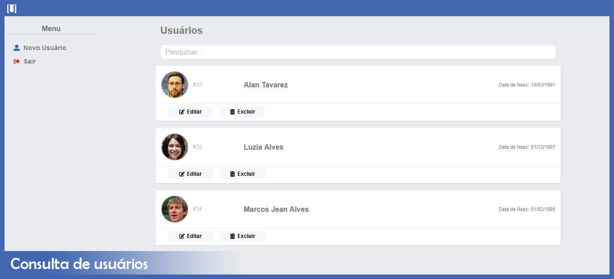

<p align="center">
  
</p>
<p align="center">
  CRUD cadrastro de usuários
</p>
<p align="center">
  
</p>

## Tecnologias
```
- [x] NodeJS
- [x] Express
- [x] Postgresql
- [x] Sequelize
- [x] Typescript
```
```
- [x] ReactJS
- [x] Bootstrap
- [x] Axios
- [x] Styled Components
```

## Images
<p align="center">
  
</p>
<p align="center">
  
</p>
<p align="center">
  
</p>

## Schema Banco de Dados
<p align="center">
  
</p>

## Instalação
### Back-end 
```
Criar Tabela faceuser no banco de dados
cd backend-faceuser
npx sequelize-cli db:migrate (Carregar schema das tabelas)
npm run dev
```

### Front-end (Web)
```
cd web-faceuser
npm install
npm start
```
